# Enterprise Architecture Service Catalog

## Executive Summary

The Enterprise Architecture (EA) function serves as a strategic partner to the enterprise, providing services that enable informed decision-making, optimize investments, and reduce organizational risk. This catalog defines the services we provide across three primary domains: **Business Architecture**, **Technology Architecture**, and **Portfolio Strategy Office**.

Our services are designed to **enable and accelerate** business objectives—not to create bottlenecks. We work collaboratively with stakeholders to ensure that strategic initiatives are positioned for success through sound architectural guidance, transparent portfolio management, and alignment of technology investments with business outcomes.

---

## How to Use This Catalog

- **Business Leaders**: Identify which services support your strategic initiatives and operational needs
- **Project Sponsors**: Understand how EA services integrate into your project lifecycle, from advisory support to architectural governance
- **IT Leadership**: Leverage EA services for technology strategy, roadmap planning, standards governance, and investment optimization
- **Solution Architects**: Access architectural guidance, standards, design patterns, and review processes
- **Finance**: Partner with us on capital planning and portfolio investment visibility

**Key Principle**: EA services are advisory and enabling. We provide expertise, frameworks, and insights that empower stakeholders to make better decisions faster.

---

## Enterprise Architecture Service Portfolio Overview

The EA function delivers **13 services** across **3 integrated domains** that work together to enable strategy-to-execution alignment:

```mermaid
graph TB
    subgraph BA[" "]
        direction TB
        BA_TITLE["<b>BUSINESS ARCHITECTURE</b><br/>Strategic Business Models & Insights"]
        BA01["BA-01: Business Capability<br/>Management"]
        BA02["BA-02: Value Stream Catalog<br/>& Optimization"]
        BA03["BA-03: Business Architecture<br/>Advisory Services"]

        BA_TITLE --> BA01
        BA_TITLE --> BA02
        BA_TITLE --> BA03
    end

    subgraph TA[" "]
        direction TB
        TA_TITLE["<b>TECHNOLOGY ARCHITECTURE</b><br/>Technology Direction & Governance"]
        TA01["TA-01: Technology Roadmap<br/>Management & Ownership"]
        TA02["TA-02: Architecture Review<br/>Board Services"]
        TA03["TA-03: Design Assurance &<br/>Architecture Advisory"]
        TA04["TA-04: Architecture Standards<br/>& Governance"]
        TA05["TA-05: Solution Architecture<br/>for Major Initiatives"]

        TA_TITLE --> TA01
        TA_TITLE --> TA02
        TA_TITLE --> TA03
        TA_TITLE --> TA04
        TA_TITLE --> TA05
    end

    subgraph PSO[" "]
        direction TB
        PSO_TITLE["<b>PORTFOLIO STRATEGY OFFICE</b><br/>Investment Optimization & Performance"]
        PSO01["PSO-01: Strategic Demand<br/>Intake & Assessment"]
        PSO02["PSO-02: Technology Capital<br/>Planning & Budget Alignment"]
        PSO03["PSO-03: Strategic Portfolio<br/>Management Platform"]
        PSO04["PSO-04: Portfolio Performance<br/>& Insights"]
        PSO05["PSO-05: Strategic Portfolio<br/>Advisory Services"]

        PSO_TITLE --> PSO01
        PSO_TITLE --> PSO02
        PSO_TITLE --> PSO03
        PSO_TITLE --> PSO04
        PSO_TITLE --> PSO05
    end

    classDef titleStyle fill:#2C3E50,stroke:#34495E,stroke-width:3px,color:#ECF0F1,font-weight:bold
    classDef baStyle fill:#3498DB,stroke:#2980B9,stroke-width:2px,color:#fff
    classDef taStyle fill:#E74C3C,stroke:#C0392B,stroke-width:2px,color:#fff
    classDef psoStyle fill:#2ECC71,stroke:#27AE60,stroke-width:2px,color:#fff

    class BA_TITLE,TA_TITLE,PSO_TITLE titleStyle
    class BA01,BA02,BA03 baStyle
    class TA01,TA02,TA03,TA04,TA05 taStyle
    class PSO01,PSO02,PSO03,PSO04,PSO05 psoStyle
```

### Service Integration Flow

```mermaid
graph LR
    subgraph STRATEGY["STRATEGY & PLANNING"]
        BA01["BA-01<br/>Capability<br/>Management"]
        TA01["TA-01<br/>Technology<br/>Roadmap"]
        PSO02["PSO-02<br/>Capital<br/>Planning"]
    end

    subgraph DEMAND["DEMAND & DESIGN"]
        PSO01["PSO-01<br/>Demand<br/>Intake"]
        BA03["BA-03<br/>Business Arch<br/>Advisory"]
        TA03["TA-03<br/>Design<br/>Assurance"]
    end

    subgraph GOVERNANCE["GOVERNANCE & COMPLIANCE"]
        TA04["TA-04<br/>Architecture<br/>Standards"]
        TA02["TA-02<br/>Architecture<br/>Review Board"]
        BA02["BA-02<br/>Value Stream<br/>Optimization"]
    end

    subgraph EXECUTION["EXECUTION & PERFORMANCE"]
        PSO03["PSO-03<br/>SPM<br/>Platform"]
        PSO04["PSO-04<br/>Portfolio<br/>Performance"]
        PSO05["PSO-05<br/>Portfolio<br/>Advisory"]
    end

    STRATEGY --> DEMAND
    DEMAND --> GOVERNANCE
    GOVERNANCE --> EXECUTION
    EXECUTION -.Feedback.-> STRATEGY

    classDef strategyStyle fill:#3498DB,stroke:#2980B9,stroke-width:2px,color:#fff
    classDef demandStyle fill:#9B59B6,stroke:#8E44AD,stroke-width:2px,color:#fff
    classDef govStyle fill:#E74C3C,stroke:#C0392B,stroke-width:2px,color:#fff
    classDef execStyle fill:#2ECC71,stroke:#27AE60,stroke-width:2px,color:#fff

    class BA01,TA01,PSO02 strategyStyle
    class PSO01,BA03,TA03 demandStyle
    class TA04,TA02,BA02 govStyle
    class PSO03,PSO04,PSO05 execStyle
```

### Quick Service Finder

**Need help with strategic planning?**
→ BA-01 (Capability Management), TA-01 (Technology Roadmap), PSO-02 (Capital Planning)

**Starting a new initiative?**
→ PSO-01 (Demand Intake), BA-03 (Business Architecture Advisory), TA-03 (Design Assurance)

**Need architectural approval?**
→ TA-02 (Architecture Review Board), TA-04 (Standards & Governance)

**Leading a major/complex initiative?**
→ TA-05 (Solution Architecture for Major Initiatives)

**Want portfolio visibility?**
→ PSO-03 (SPM Platform), PSO-04 (Portfolio Performance), PSO-05 (Portfolio Advisory)

**Optimizing operations?**
→ BA-02 (Value Stream Optimization)

---

## Service Domain 1: Business Architecture

The Business Architecture domain provides foundational models and insights that help the organization understand "what we do" independent of "how we do it." These services enable strategic planning, transformation initiatives, and cross-functional alignment.

### BA-01: Business Capability Management

**Service Owner**: Lead Business Architect

**Purpose**: Maintain and evolve the enterprise capability model that provides a common language for describing what the utility does across all business units.

**Value Delivered**:
- **Strategic Planning**: Provides heat maps showing capability maturity and investment levels to inform strategic priorities
- **Portfolio Alignment**: Enables portfolio analysis by capability to identify gaps, overlaps, and optimization opportunities
- **Transformation Clarity**: Creates a stable view of the business that doesn't change when organizations restructure
- **Vendor/Solution Evaluation**: Accelerates make/buy/partner decisions by mapping solutions to capabilities

**Primary Customers**:
- Executive Leadership (strategic planning)
- Portfolio Strategy Office (investment planning)
- Business Unit Leaders (transformation initiatives)
- IT Leadership (application portfolio rationalization)

**Key Activities**:
- Facilitate annual capability model review and updates
- Produce capability heat maps (maturity, cost, strategic importance)
- Support business case development with capability-based analysis
- Enable portfolio reporting by capability domain
- Partner with business units on capability deep-dives

**Inputs**:
- Strategic plan and business priorities
- Business unit transformation initiatives
- Application portfolio and technology spend data
- Stakeholder feedback on capability definitions

**Outputs**:
- Enterprise capability model (L1-L3 levels)
- Capability heat maps and assessments
- Capability-to-application mappings
- Capability gap analysis for strategic initiatives
- Executive dashboards showing investment by capability

**Service Levels**:
- Annual model review and update cycle
- Quarterly capability heat map refresh
- Ad-hoc capability analysis upon request (2-5 business days)

**How to Engage**: Contact Business Architecture team via EA intake process or directly for strategic planning sessions

---

### BA-02: Value Stream Catalog & Optimization

**Service Owner**: Business Architecture Team

**Purpose**: Document and optimize the end-to-end value streams that deliver outcomes to customers, stakeholders, and the enterprise.

**Value Delivered**:
- **Process Improvement**: Identifies pain points, delays, and handoff inefficiencies across value streams
- **Customer Experience**: Enables customer journey optimization by understanding touchpoints and pain points
- **Regulatory Compliance**: Supports audit readiness and regulatory reporting by documenting critical processes
- **Technology Investment**: Informs automation and digitalization priorities based on value stream bottlenecks
- **Operational Resilience**: Highlights dependencies and risks within critical operational workflows

**Primary Customers**:
- Operations Leadership (process optimization)
- Customer Operations (CX improvement)
- Regulatory Affairs (compliance documentation)
- IT Leadership (automation prioritization)
- Continuous Improvement teams

**Key Activities**:
- Facilitate value stream mapping workshops
- Document value stream stages, stakeholders, and metrics
- Analyze value stream performance (cycle time, pain points, handoffs)
- Recommend optimization opportunities
- Support initiative teams with value stream context

**Inputs**:
- Business process documentation
- Customer experience data and feedback
- Operational metrics (cycle time, throughput, quality)
- Stakeholder interviews and workshops
- Technology landscape information

**Outputs**:
- Value stream catalog with stage models
- Value stream performance dashboards
- Optimization opportunity assessments
- Value stream stakeholder maps (RACI)
- As-is and to-be value stream models for initiatives

**Service Levels**:
- New value stream documentation: 2-3 weeks (depending on complexity)
- Value stream optimization analysis: 1-2 weeks
- Quarterly value stream catalog updates

**How to Engage**: Submit request via EA intake for value stream mapping or contact Business Architecture for ongoing improvement initiatives

---

### BA-03: Business Architecture Advisory Services

**Service Owner**: Lead Business Architect

**Purpose**: Provide expert advisory services to strategic initiatives, ensuring they are grounded in sound business architecture principles and aligned with enterprise direction.

**Value Delivered**:
- **Initiative Success**: Increases project success rates by ensuring clear scope, stakeholder alignment, and capability readiness
- **Avoid Rework**: Identifies architectural issues early before significant investment
- **Cross-Functional Alignment**: Facilitates collaboration across siloed business units
- **Reuse & Leverage**: Highlights existing capabilities and solutions that can be leveraged
- **Strategic Coherence**: Ensures initiatives align with and advance enterprise strategic objectives

**Primary Customers**:
- Strategic Initiative Sponsors and Leads
- Business Transformation Programs
- Executive Leadership (strategic planning)
- Business Unit Leaders launching new capabilities

**Key Activities**:
- Participate in initiative kickoffs and planning sessions
- Conduct impact assessments across capabilities and value streams
- Facilitate stakeholder identification and alignment workshops
- Review business cases for architectural soundness
- Provide ongoing advisory support throughout initiative lifecycle
- Connect initiative teams with relevant enterprise assets and expertise

**Inputs**:
- Initiative charter and business case
- Strategic objectives and success metrics
- Stakeholder landscape
- Current state capability and value stream models

**Outputs**:
- Business architecture impact assessment
- Stakeholder maps and engagement recommendations
- Capability and value stream alignment documentation
- Architectural guidance and recommendations
- Connections to related initiatives and enterprise assets

**Service Levels**:
- Initial impact assessment: 3-5 business days
- Ongoing advisory: as-needed basis throughout initiative
- Workshop facilitation: scheduled based on availability

**How to Engage**: Include Business Architecture in initiative planning; submit EA intake request for formal assessment

---

## Service Domain 2: Technology Architecture

The Technology Architecture domain provides services that define, manage, and govern the technology direction of the enterprise. These services ensure technology investments are aligned with business strategy, enable interoperability, and create a coherent technology landscape.

### TA-01: Technology Roadmap Management & Ownership

**Service Owner**: Chief Architect / Lead Technology Architect

**Purpose**: Develop, maintain, and govern comprehensive technology roadmaps that align technology evolution with business strategy, capability development, and investment priorities across the enterprise.

**Value Delivered**:
- **Strategic Alignment**: Ensures technology investments directly support business capabilities and strategic objectives
- **Investment Sequencing**: Provides clear multi-year view of technology evolution to guide capital planning and portfolio prioritization
- **Dependency Management**: Identifies and manages technology dependencies, enabling proper sequencing of initiatives
- **Risk Reduction**: Anticipates technology obsolescence, vendor risks, and integration challenges before they become crises
- **Stakeholder Transparency**: Creates shared understanding of technology direction across business and IT stakeholders
- **Architectural Coherence**: Ensures technology choices build toward a coherent future state rather than creating fragmentation

**Primary Customers**:
- Executive Leadership (technology investment decisions)
- CIO and IT Leadership (technology strategy and planning)
- Business Unit Leaders (understanding technology enablement timelines)
- Portfolio Strategy Office (capital planning and initiative sequencing)
- Enterprise and Solution Architects (technology standards and direction)
- Vendors and Strategic Technology Partners (partnership planning)

**Key Activities**:
- Develop and maintain enterprise technology roadmaps (infrastructure, applications, data, security, integration)
- Facilitate quarterly technology roadmap governance reviews with stakeholders
- Align technology roadmaps with business capability evolution and strategic initiatives
- Conduct technology landscape assessments and gap analysis
- Manage technology investment themes and sequencing logic
- Define technology transition paths and migration strategies
- Coordinate roadmap dependencies across business units and domains
- Track roadmap execution and adjust based on portfolio performance
- Evaluate emerging technologies and recommend adoption timing
- Publish roadmap views tailored to different stakeholder audiences

**Inputs**:
- Enterprise strategic plan and business priorities
- Business capability maturity assessments and evolution plans (from BA-01)
- Technology capital plan and portfolio pipeline (from PSO-02)
- Current state technology landscape and inventory
- Vendor technology roadmaps and product lifecycle information
- Technology trends, industry benchmarks, and emerging technology assessments
- Business unit technology needs and pain points
- Technical debt assessments and remediation priorities
- Regulatory and compliance technology requirements

**Outputs**:
- Enterprise technology roadmap (3-5 year horizon) by domain:
  - Infrastructure roadmap (cloud, network, compute, storage)
  - Application portfolio roadmap (modernization, rationalization, new capabilities)
  - Data and analytics roadmap (platforms, governance, advanced analytics)
  - Integration and API roadmap (middleware, service bus, API management)
  - Security and compliance roadmap (cybersecurity, identity, risk management)
  - Emerging technology roadmap (AI/ML, IoT, edge computing, quantum)
- Capability-to-technology roadmap mappings
- Technology dependency maps and sequencing recommendations
- Technology investment themes aligned to strategic objectives
- Roadmap dashboards showing execution progress vs. plan
- Technology standards and direction documentation
- Vendor and partnership strategy recommendations
- Technology sunset and migration plans
- Executive roadmap summary views (one-page strategic roadmaps)

**Service Levels**:
- Annual roadmap refresh and publication: Q4
- Quarterly roadmap governance reviews: Within first month of each quarter
- Monthly roadmap execution tracking updates
- Ad-hoc roadmap impact analysis for new initiatives: 3-5 business days
- Emerging technology assessments: 2-3 weeks per technology domain

**How to Engage**:
- Participate in quarterly technology roadmap governance forums
- Request roadmap briefings for strategic planning or initiative planning
- Submit technology roadmap change requests via EA intake
- Contact Technology Architecture team for roadmap analysis or emerging technology assessments

**Roadmap Governance Structure**:
- **Chief Information Officer (CIO)**: Overall ownership of enterprise technology roadmap and investment authority
- **Chief Digital & Innovation Officer (CDIO)**: Non-regulated technology innovation roadmap and digital product platform roadmaps
- **Chief Operating Officer (COO)**: Regulated operations technology and OT/IT convergence roadmaps
- **VP, Data & Analytics**: Data platform, analytics, and AI/ML roadmaps
- **VP, IT Operations & Infrastructure**: Core IT infrastructure, cloud, network, and security roadmaps
- **Enterprise Architecture Team**: Roadmap integration, standards governance, and cross-domain alignment
- **Technology Roadmap Governance Council**: Quarterly reviews, investment prioritization, and roadmap approval authority (CIO, CDIO, COO, CFO, Chief Architect, Business Unit CIOs)
- **Business Unit Technology Liaisons**: Embedded architects ensuring business-IT roadmap alignment and translating business needs into technology requirements

**Integration with Other EA Services**:
- **With BA-01 (Capability Management)**: Technology roadmaps align to capability evolution plans; capability maturity gaps inform technology investment priorities
- **With PSO-02 (Capital Planning)**: Roadmaps provide the sequencing logic for multi-year capital planning; capital constraints inform roadmap phasing
- **With PSO-04 (Portfolio Performance)**: Portfolio execution data informs roadmap adjustments; roadmap provides context for evaluating initiative performance
- **With BA-03 (BA Advisory)**: Roadmaps inform architectural guidance for initiatives; initiative learnings feed back into roadmap refinement

---

### TA-02: Architecture Review Board (ARB) Services

**Service Owner**: Chief Architect

**Purpose**: Provide structured architectural governance through formal review of technology solutions, ensuring alignment with enterprise architecture principles, standards, and strategic direction before significant investment or implementation.

**Value Delivered**:
- **Risk Mitigation**: Identifies architectural risks, technical debt, and integration issues before costly implementation
- **Investment Protection**: Ensures technology investments are sound and aligned with enterprise direction
- **Standards Compliance**: Validates adherence to enterprise architecture standards and patterns
- **Knowledge Sharing**: Disseminates architectural best practices and lessons learned across the organization
- **Cross-Initiative Alignment**: Identifies opportunities for reuse and prevents duplicative solutions
- **Quality Assurance**: Ensures solutions are scalable, secure, maintainable, and supportable

**Primary Customers**:
- Solution Architects (submitting designs for review)
- Project Sponsors and Initiative Leads (architectural approval for projects)
- IT Leadership (architectural governance compliance)
- Vendors and System Integrators (design validation)
- Security and Compliance teams (architectural risk assessment)

**Key Activities**:
- Conduct formal Architecture Review Board meetings (bi-weekly or monthly)
- Review solution architecture designs against enterprise standards
- Assess technology choices for strategic fit and roadmap alignment
- Evaluate integration approaches and data architecture
- Review security architecture and compliance considerations
- Provide architectural decisions and recommendations
- Track architectural exceptions and waivers
- Escalate significant architectural risks to leadership
- Maintain ARB decision log and architectural precedents
- Facilitate architectural dispute resolution

**Architecture Review Stages**:
1. **Conceptual Review** (Early Planning): High-level approach, technology choices, alignment check
2. **Logical Review** (Design Phase): Detailed architecture, integration patterns, data flows
3. **Implementation Review** (Pre-Build): Build approach, deployment model, operational readiness
4. **Post-Implementation Review**: Lessons learned, actual vs. planned architecture

**Inputs**:
- Solution architecture documentation and design artifacts
- Business requirements and functional specifications
- Technology roadmaps and enterprise standards (from TA-01, TA-04)
- Integration and data flow diagrams
- Security and compliance requirements
- Vendor proposals and technical evaluations
- Previous ARB decisions and architectural patterns

**Outputs**:
- ARB review decisions (Approved, Conditionally Approved, Not Approved, Deferred)
- Architectural guidance and recommendations
- Identified risks and mitigation strategies
- Required design changes or conditions for approval
- Architectural exceptions and waivers (with justification)
- ARB decision log and meeting minutes
- Architectural findings and corrective actions
- Reusable patterns and reference architectures

**Service Levels**:
- ARB meeting frequency: Bi-weekly or monthly (based on demand)
- Submission deadline: 5 business days before ARB meeting
- Initial review completeness check: 2 business days
- ARB decision communication: Within 2 business days of meeting
- Expedited review for urgent initiatives: 3-5 business days (by exception)

**ARB Membership**:
- **Chair**: Chief Architect or Lead Enterprise Architect
- **Core Members**:
  - Lead Technology Architect
  - Lead Security Architect
  - Lead Data Architect
  - Lead Infrastructure Architect
  - Lead Application Architect
- **Advisory Members** (as needed):
  - Business Architects
  - Domain Architects (Cloud, Integration, Analytics)
  - IT Operations Leadership
  - Information Security Leadership
- **Voting Rights**: Core members; Chair has tie-breaking authority
- **Quorum**: Minimum 3 core members for decision-making

**Review Triggers (When ARB Review is Required)**:
- New technology introductions or major version upgrades
- Solutions exceeding capital threshold (e.g., $250K+)
- Cross-functional or enterprise-wide initiatives
- Cloud migrations or infrastructure changes
- New integration patterns or middleware
- Data architecture changes affecting multiple systems
- Security architecture for critical systems
- Deviations from established standards (exception requests)

**How to Engage**:
- Submit architecture review request via EA intake portal
- Use ARB submission template with required documentation
- Attend ARB meeting to present and answer questions
- Contact Chief Architect for pre-ARB consultation or guidance

**Integration with Other EA Services**:
- **With TA-01 (Roadmap Management)**: Validates solutions align with technology roadmaps
- **With TA-04 (Standards & Governance)**: Enforces compliance with enterprise standards
- **With BA-03 (BA Advisory)**: Incorporates business architecture guidance into reviews
- **With PSO-01 (Demand Intake)**: ARB review is gate in demand-to-delivery process

---

### TA-03: Design Assurance & Architecture Advisory

**Service Owner**: Enterprise Architecture Team

**Purpose**: Provide proactive, consultative architecture advisory services throughout the initiative lifecycle, ensuring solutions are designed for success before formal ARB review.

**Value Delivered**:
- **Early Guidance**: Helps teams make sound architectural decisions early, avoiding costly rework
- **Faster ARB Approval**: Designs that receive advisory support pass ARB review faster with fewer conditions
- **Knowledge Transfer**: Builds architectural capability within delivery teams
- **Collaboration**: Fosters partnership between EA and delivery teams rather than "ivory tower" architecture
- **Quality Designs**: Results in better architected, more maintainable solutions
- **Risk Reduction**: Identifies and resolves architectural issues before they become problems

**Primary Customers**:
- Solution Architects (architecture design support)
- Project Teams and Initiative Leads (architectural guidance)
- Business Analysts (translating requirements to architectural needs)
- Vendors and Implementation Partners (design collaboration)
- Product Owners (technical feasibility and approach)

**Key Activities**:
- Participate in solution design workshops and architecture sessions
- Review architecture artifacts and provide feedback iteratively
- Conduct architectural health checks and design reviews
- Provide reference architectures and design patterns
- Mentor solution architects on EA standards and best practices
- Facilitate technical design decisions and trade-off analysis
- Connect teams with relevant expertise and prior art
- Conduct proof-of-concept reviews and technical spikes
- Provide pre-ARB readiness assessments
- Support vendor RFP evaluation from architectural perspective

**Advisory Engagement Levels**:
1. **Light Touch** (Low complexity/risk): Ad-hoc questions, reference to standards and patterns, minimal review
2. **Standard** (Medium complexity/risk): Periodic design reviews, checkpoint meetings, feedback on key artifacts
3. **Embedded** (High complexity/risk): Dedicated architect assigned to team, ongoing participation in design activities

**Inputs**:
- Business requirements and use cases
- Solution architecture work in progress
- Technical constraints and requirements
- Integration requirements and dependencies
- Current state architecture and systems landscape
- Enterprise architecture standards and patterns (from TA-04)
- Technology roadmaps (from TA-01)

**Outputs**:
- Architectural guidance and design recommendations
- Reviewed and improved architecture documentation
- Reference architectures and reusable patterns
- Technology selection guidance and evaluations
- Integration approach recommendations
- Design review findings and recommendations
- Pre-ARB readiness assessment
- Architectural mentoring and knowledge transfer

**Service Levels**:
- Initial advisory request response: 2 business days
- Ad-hoc question response: 1 business day
- Design review scheduling: Within 1 week
- Design review feedback delivery: 3-5 business days after review
- Embedded architect assignment: Subject to capacity, typically 1-2 weeks notice

**When to Engage Design Assurance**:
- **Early/Conceptual Phase**: Technology approach, high-level architecture, feasibility
- **Design Phase**: Detailed architecture, integration patterns, data models
- **RFP/Vendor Selection**: Architectural evaluation criteria, vendor response assessment
- **Before ARB Submission**: Pre-review to ensure readiness and address issues
- **Implementation Support**: Clarification of design decisions, addressing emergent issues

**How to Engage**:
- Submit design assurance request via EA intake
- Reach out directly to Enterprise Architecture team for informal consultation
- Include EA in initiative planning and design workshops
- Request embedded architect for complex/strategic initiatives

**Design Assurance Toolkit**:
- Solution architecture review checklist
- Reference architecture library (by domain)
- Design pattern catalog (integration, security, data, etc.)
- Technology evaluation framework
- ARB submission readiness checklist
- Architecture maturity assessment

**Integration with Other EA Services**:
- **With TA-02 (ARB)**: Prepares solutions for successful ARB review
- **With TA-01 (Roadmap Management)**: Ensures designs align with technology direction
- **With TA-04 (Standards & Governance)**: Applies standards in consultative manner
- **With BA-03 (BA Advisory)**: Collaborates on business and technical architecture alignment

---

### TA-04: Architecture Standards & Governance

**Service Owner**: Chief Architect / Enterprise Architecture Team

**Purpose**: Define, maintain, and govern enterprise architecture standards, principles, and policies that guide technology decisions and ensure a coherent, interoperable technology landscape.

**Value Delivered**:
- **Consistency**: Ensures consistent technology choices across the enterprise, reducing complexity
- **Interoperability**: Standards enable systems to integrate and share data seamlessly
- **Risk Reduction**: Proven standards reduce technical risk compared to bespoke approaches
- **Cost Efficiency**: Standardization enables economies of scale in licensing, support, and training
- **Faster Delivery**: Teams don't reinvent the wheel; approved patterns accelerate development
- **Quality**: Standards embody best practices, improving security, performance, and maintainability
- **Vendor Management**: Standardized technology stack simplifies vendor relationships and negotiations

**Primary Customers**:
- Solution Architects (applying standards to designs)
- IT Leadership (technology strategy and vendor management)
- Development Teams (implementation standards and patterns)
- Security and Compliance (security standards enforcement)
- Procurement (approved vendor and product lists)
- Third-party vendors and integrators (integration standards)

**Key Activities**:
- Develop and maintain enterprise architecture principles and standards
- Define technology standards by domain (infrastructure, application, data, integration, security)
- Maintain approved technology stack and product standards
- Create and publish architecture reference models and patterns
- Facilitate architecture standards governance and change control
- Assess emerging technologies for potential standardization
- Manage architecture exception and waiver process
- Conduct architecture compliance audits and assessments
- Publish architecture guidance, playbooks, and standards documentation
- Train and educate organization on architecture standards

**Architecture Standards Domains**:
1. **Infrastructure Standards**: Cloud platforms, virtualization, network, storage, compute
2. **Application Standards**: Development frameworks, languages, application patterns, deployment models
3. **Data Standards**: Databases, data platforms, data modeling, master data, metadata
4. **Integration Standards**: APIs, messaging, ESB, integration patterns, data exchange formats
5. **Security Standards**: Authentication, authorization, encryption, secure coding, compliance
6. **DevOps Standards**: CI/CD, automation, infrastructure-as-code, container orchestration
7. **Emerging Technology Standards**: AI/ML, IoT, edge computing, blockchain (as applicable)

**Inputs**:
- Enterprise strategic plan and IT strategy
- Technology roadmaps (from TA-01)
- Industry best practices and standards (ISO, TOGAF, NIST, etc.)
- Vendor product roadmaps and technology trends
- ARB decisions and architectural learnings (from TA-02)
- Regulatory and compliance requirements
- Architecture community feedback and change requests
- Security and risk management requirements

**Outputs**:
- **Enterprise Architecture Principles**: Foundational beliefs guiding all architecture decisions
- **Technology Standards Documentation**: Detailed standards by domain with rationale
- **Approved Technology Stack**: List of approved products, platforms, and versions
- **Reference Architectures**: Canonical solution patterns for common scenarios
- **Design Patterns Library**: Reusable patterns for integration, security, data, etc.
- **Architecture Decision Records (ADRs)**: Documentation of key architecture decisions
- **Standards Compliance Metrics**: Tracking adoption and compliance across portfolio
- **Exception/Waiver Process**: Guidelines and tracking for standards deviations
- **Architecture Guidelines and Playbooks**: Practical guidance for applying standards

**Service Levels**:
- Annual standards review and update cycle: Q4
- Quarterly standards governance forum
- Architecture principles: Reviewed annually or upon strategic changes
- New technology evaluation for standardization: 4-6 weeks
- Exception/waiver request review: 1 week
- Standards documentation updates: Published within 2 weeks of approval
- Ad-hoc standards questions: 2 business days

**Architecture Governance Framework**:
- **Architecture Principles**: 8-12 core principles (e.g., "Buy before Build", "API-First", "Cloud-First")
- **Standards Tiers**:
  - **Mandatory Standards**: Required for all new solutions (e.g., approved cloud platforms)
  - **Recommended Standards**: Preferred unless justified exception (e.g., programming languages)
  - **Emerging Standards**: Under evaluation, pilot projects allowed (e.g., new AI/ML tools)
  - **Sunset Standards**: Being phased out, no new implementations (e.g., legacy platforms)

**Exception and Waiver Process**:
1. Solution team submits exception request with business/technical justification
2. EA team evaluates impact on standards compliance and architectural coherence
3. ARB reviews exception requests requiring architectural approval
4. Exceptions granted with time limits and conditions
5. Exception tracking and periodic review for potential standard changes

**How to Engage**:
- Access standards portal/repository for current standards documentation
- Submit standards change requests or exception requests via EA intake
- Participate in quarterly architecture standards forums
- Contact EA team for standards interpretation or guidance
- Request standards training or workshops for teams

**Standards Communication & Adoption**:
- Architecture standards portal (central repository)
- Quarterly architecture town halls and standards updates
- Architecture Community of Practice (monthly)
- Standards training and onboarding for new architects
- Standards champions embedded in major business units
- Regular architecture blog posts and communications

**Integration with Other EA Services**:
- **With TA-02 (ARB)**: Standards are the evaluation criteria for ARB reviews
- **With TA-03 (Design Assurance)**: Standards guide advisory recommendations
- **With TA-01 (Roadmap Management)**: Standards evolve with technology roadmap
- **With PSO-03 (SPM Platform)**: Standards compliance tracked in portfolio

---

### TA-05: Solution Architecture for Major Initiatives

**Service Owner**: Enterprise Architecture Team / Chief Architect

**Purpose**: Provide dedicated, hands-on solution architecture expertise for large-scale, complex, or strategic initiatives, ensuring end-to-end architectural design and successful implementation.

**Value Delivered**:
- **Deep Expertise**: Dedicated architect with solution design ownership throughout initiative lifecycle
- **End-to-End Design**: Comprehensive solution architecture across all layers (business, application, data, infrastructure, integration, security)
- **Implementation Success**: Architecture remains viable from design through deployment and operations
- **Risk Mitigation**: Continuous architectural oversight identifies and resolves issues in real-time
- **Team Augmentation**: Fills capability gaps when internal teams lack specialized architectural expertise
- **Knowledge Transfer**: Builds solution architecture capability within delivery teams

**Primary Customers**:
- Strategic Initiative Sponsors (transformation programs, major investments)
- Program/Project Managers (large, complex initiatives)
- Business Unit Leaders (critical business capabilities)
- IT Leadership (enterprise-wide technology initiatives)
- Vendors and Implementation Partners (major system implementations)

**Key Activities**:
- Lead end-to-end solution architecture design and documentation
- Define solution architecture vision and roadmap for multi-phase initiatives
- Design detailed architecture across all domains (application, data, integration, infrastructure, security)
- Create solution architecture blueprints, models, and specifications
- Lead technical design sessions and architecture workshops
- Evaluate and recommend technology products and platforms
- Design integration patterns and data flows across systems
- Define non-functional requirements (performance, scalability, security, resilience)
- Conduct proof-of-concepts and technical validation
- Provide architecture guidance to development teams during implementation
- Review detailed designs and code architecture for alignment
- Support testing strategy, deployment planning, and operational readiness
- Ensure traceability from business requirements to technical implementation
- Prepare and present architecture artifacts for ARB review
- Document as-built architecture and lessons learned

**When Solution Architecture is Required**:
- **Capital threshold**: Initiatives exceeding $1M+ in technology investment
- **Strategic importance**: CEO/Board-level visibility or enterprise transformation programs
- **Technical complexity**: Multiple system integrations, new technology platforms, complex data migrations
- **Organizational impact**: Cross-functional initiatives affecting multiple business units
- **Regulatory/compliance**: Critical systems subject to regulatory oversight or audit
- **Vendor implementations**: Major ERP, CRM, or enterprise platform implementations
- **Innovation initiatives**: First-of-kind solutions using emerging technologies
- **Architectural precedent**: Solutions that establish new patterns for enterprise adoption

**Solution Architecture Engagement Model**:

1. **Full-Time Embedded** (Strategic/Complex Initiatives)
   - Dedicated solution architect assigned full-time to initiative
   - Duration: Typically 6-18 months through design and implementation
   - Scope: Owns solution architecture from concept to production
   - Examples: ERP implementation, enterprise data platform, digital transformation program

2. **Part-Time Allocated** (Major Initiatives)
   - Solution architect allocated 50% time to initiative
   - Duration: 3-12 months through critical phases
   - Scope: Leads architecture design, periodic implementation oversight
   - Examples: Major application modernization, cloud migration, system consolidation

3. **Phase-Based** (Multi-Year Programs)
   - Solution architect engaged for specific phases/releases
   - Duration: 2-6 months per phase
   - Scope: Design for phase, handoff to delivery team, return for next phase
   - Examples: Multi-year capability buildout, phased legacy modernization

**Inputs**:
- Business case and strategic objectives
- Business requirements and user stories
- Current state architecture and technology landscape
- Integration requirements and system inventory
- Non-functional requirements and constraints
- Technology roadmaps and enterprise standards (from TA-01, TA-04)
- Capability models and value stream maps (from BA-01, BA-02)
- Vendor product evaluations and RFP responses
- Budget and timeline constraints
- Regulatory and compliance requirements

**Outputs**:
- **Solution Architecture Vision**: High-level architecture approach and guiding principles
- **Solution Architecture Blueprint**: Comprehensive architecture across all layers
  - Business architecture (capabilities, processes, information)
  - Application architecture (systems, components, services)
  - Data architecture (data models, flows, governance)
  - Integration architecture (interfaces, APIs, middleware)
  - Infrastructure architecture (cloud, network, compute, storage)
  - Security architecture (authentication, authorization, encryption, compliance)
- **Architecture Decision Records (ADRs)**: Documented decisions with rationale and trade-offs
- **Technology Stack Recommendations**: Specific products, platforms, and tools
- **Integration Specifications**: Detailed interface designs and data exchange formats
- **Data Migration Strategy**: Approach for legacy data transformation and cutover
- **Non-Functional Requirements**: Performance, scalability, availability, security targets
- **Deployment Architecture**: Production, DR, and environment topology
- **Operational Support Model**: Monitoring, support, and maintenance approach
- **Architecture Artifacts for ARB**: Presentation materials and supporting documentation
- **Implementation Guidance**: Design patterns, code structure, development standards
- **As-Built Architecture Documentation**: Final architecture with deviations and lessons learned

**Service Levels**:
- Solution architect assignment: 2-3 weeks from request (subject to capacity)
- Initial architecture assessment: 1-2 weeks after assignment
- High-level architecture design: 3-6 weeks
- Detailed architecture design: 6-12 weeks (varies by complexity)
- Ongoing support: Responsive to initiative needs, typically weekly touchpoints
- Architecture artifact delivery: Per agreed initiative schedule

**Solution Architect Qualifications**:
- 10+ years technology experience, 5+ years solution architecture experience
- Domain expertise relevant to initiative (e.g., ERP, data platforms, cloud, integration)
- Proven track record delivering complex solutions in production
- Strong technical depth across multiple technology domains
- Business acumen and ability to translate business needs to technical solutions
- Excellent communication and stakeholder management skills
- Relevant certifications (TOGAF, cloud platforms, enterprise platforms)

**How to Engage**:
- Submit request via EA intake specifying initiative scope and complexity
- Include business case, timeline, and budget information
- Contact Chief Architect for pre-assessment of solution architecture needs
- For strategic initiatives, engage during business case development to plan for solution architect assignment

**Success Criteria for Solution Architecture Engagement**:
- Solution delivered on-time and on-budget
- Architecture approved by ARB with minimal conditions
- Non-functional requirements met (performance, security, scalability)
- Production deployment successful with no major architectural issues
- Solution is maintainable, supportable, and evolvable
- Technical debt minimized or managed with clear remediation plan
- Development team capable of sustaining solution post-launch
- Lessons learned captured and shared with EA community

**Integration with Other EA Services**:
- **With TA-03 (Design Assurance)**: TA-03 provides advisory; TA-05 provides hands-on design ownership
- **With TA-02 (ARB)**: Solution architects prepare comprehensive ARB submissions and present solutions
- **With TA-01 (Roadmap Management)**: Solutions align with technology roadmaps; new patterns inform roadmap evolution
- **With TA-04 (Standards & Governance)**: Solution architects apply and extend enterprise standards
- **With BA-03 (BA Advisory)**: Collaborates on business-to-technology alignment
- **With PSO-04 (Portfolio Performance)**: Solution quality impacts initiative success metrics

**Transition and Sustainment**:
- Solution architect works with delivery team to transfer knowledge
- Architecture documentation delivered for operational teams
- Support model defined for post-production issues
- Technical debt inventory with prioritized remediation plan
- Periodic architecture health checks (3, 6, 12 months post-launch)
- Solution architect available for consultation post-launch (limited basis)

---

## Service Domain 3: Portfolio Strategy Office

The Portfolio Strategy Office domain provides services that optimize technology and business investments, ensure strategic alignment, and provide transparency into demand, portfolio health, and capital deployment. These services enable executive leadership to make informed investment decisions.

### PSO-01: Strategic Demand Intake & Assessment

**Service Owner**: Portfolio Strategy Office Lead

**Purpose**: Provide a transparent, consistent process for capturing, assessing, and routing business demand for technology investments and strategic initiatives.

**Value Delivered**:
- **Visibility**: Creates enterprise-wide visibility into all demand, preventing shadow IT and duplicative efforts
- **Fair Evaluation**: Ensures consistent evaluation criteria applied to all requests
- **Faster Routing**: Accelerates good ideas to the right teams and decision forums
- **Strategic Alignment**: Connects demand to strategic priorities and capability gaps
- **Resource Optimization**: Enables capacity planning and prevents resource overcommitment

**Primary Customers**:
- Business Unit Leaders (submitting demand)
- Executive Leadership (portfolio visibility)
- IT Leadership (capacity planning)
- PMO (project pipeline management)

**Key Activities**:
- Manage intake process and tools
- Conduct initial demand triage and completeness checks
- Facilitate demand assessment with EA, IT, Finance, and business stakeholders
- Score and prioritize demand based on strategic value, risk, cost, and readiness
- Route approved demand to appropriate execution channels
- Provide feedback to demand originators throughout process

**Inputs**:
- Demand requests from business units
- Strategic priorities and capability investment themes
- IT capacity and resource availability
- Preliminary cost and level-of-effort estimates
- Enterprise architecture assessments

**Outputs**:
- Demand intake queue with status visibility
- Demand assessment scorecards
- Prioritized demand backlog
- Routing recommendations (capital project, O&M initiative, quick-win, etc.)
- Feedback to requestors on status and next steps

**Service Levels**:
- Initial triage: 2 business days
- Full assessment: 1-2 weeks (depending on complexity)
- Monthly demand review cycle with stakeholders
- Real-time status visibility via portfolio tool

**How to Engage**: Submit demand via enterprise intake portal or contact Portfolio Strategy Office for guidance on shaping demand

---

### PSO-02: Technology Capital Planning & Budget Alignment

**Service Owner**: Portfolio Strategy Office Lead (partnership with FP&A)

**Purpose**: Develop, manage, and optimize the technology capital plan in alignment with enterprise strategic priorities, business unit needs, and financial constraints.

**Value Delivered**:
- **Investment Optimization**: Ensures capital is allocated to highest-value initiatives
- **Predictability**: Provides multi-year view of technology investments for business planning
- **Compliance**: Supports regulatory rate case requirements and capital investment justification
- **Risk Management**: Balances strategic investments with technical debt, compliance, and operational needs
- **Stakeholder Alignment**: Creates shared understanding of capital constraints and trade-offs

**Primary Customers**:
- Executive Leadership (investment decisions)
- Finance/FP&A (budget planning and rate cases)
- Business Unit Leaders (capital needs and priorities)
- IT Leadership (technology roadmap alignment)

**Key Activities**:
- Facilitate annual technology capital planning cycle
- Develop capital allocation scenarios based on strategic priorities
- Partner with FP&A on budget development and variance analysis
- Conduct mid-year capital reviews and reforecasting
- Support rate case preparation with technology investment justification
- Track capital project execution and spend realization
- Analyze capital portfolio health (strategic vs. sustaining mix)

**Inputs**:
- Strategic plan and enterprise priorities
- Business unit capital needs and requests
- Technology roadmaps and infrastructure investment requirements
- Financial constraints and capital availability (from FP&A)
- Regulatory requirements and compliance needs
- Prior year capital performance and lessons learned

**Outputs**:
- Multi-year technology capital plan
- Capital allocation recommendations by strategic theme
- Capital portfolio dashboards and health metrics
- Investment justification materials for rate cases
- Monthly/quarterly capital performance reports
- Capital scenario models and trade-off analysis

**Service Levels**:
- Annual capital planning cycle: Q3-Q4
- Mid-year reforecast: Q2
- Monthly capital performance reporting
- Ad-hoc scenario analysis: 1 week

**How to Engage**: Participate in annual capital planning cycle; contact PSO for capital scenario planning or performance analysis

---

### PSO-03: Strategic Portfolio Management (SPM) Platform Ownership

**Service Owner**: Portfolio Strategy Office Lead

**Purpose**: Own and administer the Strategic Portfolio Management tool(s) that provide enterprise visibility into demand, projects, resources, and portfolio health.

**Value Delivered**:
- **Single Source of Truth**: Eliminates duplicate tracking and inconsistent reporting
- **Executive Visibility**: Provides real-time portfolio dashboards for leadership decision-making
- **Data-Driven Decisions**: Enables analysis of portfolio health, resource capacity, and investment mix
- **Efficiency**: Reduces manual reporting burden across PMO, IT, and business units
- **Governance Support**: Provides data foundation for portfolio governance and stage-gate reviews

**Primary Customers**:
- Executive Leadership (portfolio visibility and decisions)
- PMO (project tracking and reporting)
- Resource Managers (capacity planning)
- Finance (budget and spend tracking)
- Business Architecture (capability investment visibility)

**Key Activities**:
- Administer SPM platform (user access, configuration, integrations)
- Define and maintain portfolio data standards and taxonomies
- Develop executive and operational dashboards
- Train users on SPM platform capabilities
- Integrate SPM with financial, HR, and other enterprise systems
- Analyze portfolio data for insights and recommendations
- Support portfolio governance processes with data and reporting

**Inputs**:
- Project and initiative data from PMO
- Financial actuals and forecasts from Finance systems
- Resource allocation from IT and business units
- Demand pipeline from intake process
- Strategic priorities and capability taxonomy from EA

**Outputs**:
- Configured and maintained SPM platform
- Executive portfolio dashboards
- Portfolio health reports (on-time, on-budget, benefits realization)
- Resource capacity and demand analysis
- Investment mix reporting (strategic vs. sustaining, by capability)
- Data extracts for ad-hoc analysis

**Service Levels**:
- Platform availability: 99.5% uptime
- User support: 1 business day response
- Dashboard refresh: real-time or daily (depending on data source)
- New dashboard development: 1-2 weeks

**How to Engage**: Contact PSO for SPM access, training, or custom reporting needs

---

### PSO-04: Portfolio Performance & Insights

**Service Owner**: Portfolio Strategy Office Lead

**Purpose**: Provide ongoing analysis of portfolio health, investment performance, and strategic alignment to enable course corrections and continuous improvement.

**Value Delivered**:
- **Early Warning System**: Identifies at-risk initiatives before they become failures
- **Learning Organization**: Captures lessons learned and improves portfolio delivery over time
- **Accountability**: Provides objective data on portfolio execution and benefits realization
- **Optimization**: Highlights underperforming investments for potential cancellation or pivot
- **Strategic Alignment**: Tracks whether portfolio mix reflects stated strategic priorities

**Primary Customers**:
- Executive Leadership (governance and decision-making)
- PMO Leadership (delivery performance)
- Initiative Sponsors (project health visibility)
- Finance (investment performance and benefits tracking)

**Key Activities**:
- Produce monthly/quarterly portfolio health reports
- Conduct portfolio deep-dives for executive governance forums
- Analyze portfolio trends (cost overruns, schedule delays, scope changes)
- Track benefits realization against business cases
- Facilitate lessons learned and continuous improvement sessions
- Benchmark portfolio performance against industry standards
- Recommend portfolio optimizations (continue/pause/cancel/pivot)

**Inputs**:
- Project status reports from PMO
- Financial actuals from Finance systems
- Benefits realization data from business units
- Risk and issue logs from initiative teams
- Strategic priorities and capability investment targets
- SPM platform data

**Outputs**:
- Monthly portfolio health scorecards
- Quarterly executive portfolio reviews
- Portfolio trend analysis and insights
- Benefits realization reports
- Lessons learned summaries
- Portfolio optimization recommendations
- Industry benchmark comparisons

**Service Levels**:
- Monthly portfolio scorecard: First week of each month
- Quarterly executive review: Within 2 weeks of quarter-end
- Ad-hoc analysis: 3-5 business days

**How to Engage**: Portfolio reports distributed automatically; contact PSO for deep-dive analysis or governance preparation

---

### PSO-05: Strategic Portfolio Advisory Services

**Service Owner**: Portfolio Strategy Office Team

**Purpose**: Provide expert advisory support to executive leadership, business units, and initiative teams on portfolio strategy, investment decisions, and portfolio optimization.

**Value Delivered**:
- **Better Decisions**: Provides data-driven insights and scenario analysis for investment trade-offs
- **Strategic Coherence**: Ensures portfolio composition aligns with and advances strategic objectives
- **Risk Management**: Identifies portfolio-level risks (concentration, dependency, capacity)
- **Stakeholder Alignment**: Facilitates difficult conversations about priorities and resource constraints
- **Capability Building**: Transfers portfolio management knowledge to business partners

**Primary Customers**:
- Executive Leadership (strategic decisions)
- Business Unit Leaders (portfolio planning)
- Finance Leadership (investment optimization)
- Major Initiative Sponsors (portfolio fit and dependencies)

**Key Activities**:
- Facilitate portfolio strategy sessions with leadership
- Conduct portfolio scenario modeling (what-if analysis)
- Provide investment trade-off recommendations
- Advise on portfolio governance design and effectiveness
- Support business units with portfolio planning and prioritization
- Identify and analyze portfolio dependencies and risks
- Coach initiative teams on business case development

**Inputs**:
- Strategic plan and business priorities
- Portfolio performance data and trends
- Resource capacity constraints
- Financial parameters and capital availability
- Stakeholder input on priorities and concerns

**Outputs**:
- Portfolio scenario models and recommendations
- Investment trade-off analysis
- Portfolio risk assessments
- Governance design recommendations
- Facilitated strategy and prioritization sessions
- Business case guidance and templates

**Service Levels**:
- Strategic advisory sessions: scheduled based on availability
- Scenario analysis: 1-2 weeks
- Governance design support: project-based engagement

**How to Engage**: Contact PSO leadership to discuss strategic portfolio questions or request advisory support

---

## Cross-Domain Integration: How Our Services Work Together

The Business Architecture, Technology Architecture, and Portfolio Strategy Office domains are designed to work seamlessly together, creating a comprehensive view from strategy to execution:

### Strategic Planning Cycle Integration
1. **Business Architecture** provides capability maturity assessments and value stream performance insights that inform strategic priorities
2. **Technology Architecture** develops technology roadmaps aligned to capability evolution and strategic objectives
3. **Portfolio Strategy Office** translates strategic priorities and technology roadmaps into capital planning themes and demand evaluation criteria
4. **Business Architecture** assesses incoming demand for capability and value stream alignment
5. **Technology Architecture** evaluates technology fit and roadmap alignment for initiatives
6. **Portfolio Strategy Office** integrates architectural assessments into portfolio prioritization and capital allocation

### Initiative Lifecycle Integration
1. **Demand Intake** (PSO-01) captures business need and routes to appropriate assessment
2. **Business Architecture Advisory** (BA-03) assesses capability and value stream impacts
3. **Technology Roadmap Management** (TA-01) validates technology approach and roadmap alignment
4. **Design Assurance** (TA-03) provides proactive architectural guidance during design phase
5. **Architecture Review Board** (TA-02) conducts formal governance review at key milestones
6. **Capital Planning** (PSO-02) ensures funding alignment and budget availability
7. **SPM Platform** (PSO-03) tracks initiative from concept through delivery
8. **Portfolio Performance** (PSO-04) monitors execution and benefits realization
9. **Business Architecture** and **Technology Architecture** maintain enterprise models with lessons learned
10. **Standards & Governance** (TA-04) provides compliance tracking and exception management

### Executive Decision Support Integration
- Capability heat maps and value stream assessments inform portfolio investment themes
- Technology roadmaps provide multi-year view of technology evolution aligned to capabilities
- Architecture standards and compliance metrics track technology debt and risk
- ARB decisions and architectural risk assessments inform portfolio risk management
- Portfolio performance data highlights where capability and technology investments are succeeding or struggling
- Combined BA, TA, and PSO insights enable data-driven investment trade-off decisions
- Integrated dashboards show "what we're building" (portfolio), "what we're strengthening" (capabilities), "where technology is heading" (roadmaps), and "how well we're complying" (standards)

---

## Service Engagement Model

### Self-Service
- Access capability models, value stream catalog, and portfolio dashboards via enterprise portal
- Use intake portal for demand submission with automated routing

### Consultative
- Schedule workshops and advisory sessions with EA and PSO teams
- Participate in regular business architecture and portfolio governance forums
- Request custom analysis and insights

### Embedded
- For major strategic initiatives, EA and PSO can embed team members for duration of initiative
- For business unit transformations, dedicated EA/PSO partnership model available

---

## Service Level Commitments

We are committed to responsive, value-driven service delivery:

- **Intake Requests**: Initial response within 2 business days
- **Advisory Support**: Scheduled based on mutual availability, typically within 1 week
- **Analysis Deliverables**: Scoped timeline provided upfront, typically 3-10 business days
- **Regular Reporting**: Delivered on published schedule (monthly/quarterly)
- **Escalation Path**: PSO and BA leadership available for urgent needs or service issues

---

## Measuring Our Value

We track our effectiveness through several lenses:

### Input Metrics (Are we being utilized?)
- Number of advisory engagements
- Demand intake volume and cycle time
- Workshop and facilitation sessions conducted
- SPM platform adoption and usage

### Output Metrics (Are we delivering?)
- Service level agreement compliance
- Stakeholder satisfaction scores
- Deliverable quality ratings
- Response time to requests

### Outcome Metrics (Are we making an impact?)
- Initiative success rate (on-time, on-budget, benefits realized)
- Portfolio health trend (improving over time)
- Capital plan variance (forecast vs. actual)
- Capability maturity improvement
- Avoided costs through early architectural intervention
- Strategic alignment score (portfolio mix vs. priorities)

### Value Stories
We regularly capture and share specific examples of value delivered:
- Duplicate initiatives identified and consolidated
- Technical debt avoided through architectural guidance
- Investment optimization through portfolio rebalancing
- Stakeholder alignment achieved through business architecture facilitation

---

## Feedback & Continuous Improvement

This service catalog is a living document. We actively seek feedback on:
- Service usefulness and relevance
- Service delivery quality and responsiveness
- Gaps in service offerings
- Opportunities to better enable business outcomes

**Contact us**: [Insert EA team contact information]

**Annual Review**: This catalog is formally reviewed and updated annually in Q4, with ad-hoc updates as services evolve.

---

## Appendix: Service Summary Matrix

| Service ID | Service Name | Primary Value | Key Customers | Engagement Level |
|------------|--------------|---------------|---------------|------------------|
| BA-01 | Business Capability Management | Strategic planning & portfolio alignment | Exec Leadership, Portfolio Office, BU Leaders | Self-service + Consultative |
| BA-02 | Value Stream Catalog & Optimization | Process improvement & CX optimization | Operations, Customer Ops, IT, CI teams | Consultative |
| BA-03 | Business Architecture Advisory | Initiative success & alignment | Initiative Sponsors, BU Leaders, Exec Leadership | Consultative + Embedded |
| TA-01 | Technology Roadmap Management & Ownership | Technology direction & investment sequencing | Exec Leadership, CIO, IT Leadership, Portfolio Office | Consultative + Governance |
| TA-02 | Architecture Review Board (ARB) Services | Risk mitigation & standards compliance | Solution Architects, Project Sponsors, IT Leadership | Governance + Review |
| TA-03 | Design Assurance & Architecture Advisory | Early guidance & quality designs | Solution Architects, Project Teams, Vendors | Consultative + Embedded |
| TA-04 | Architecture Standards & Governance | Consistency & interoperability | Solution Architects, IT Leadership, Dev Teams | Self-service + Governance |
| TA-05 | Solution Architecture for Major Initiatives | End-to-end design ownership | Strategic Initiative Sponsors, Program Managers | Fully Embedded |
| PSO-01 | Strategic Demand Intake & Assessment | Visibility & fair evaluation | BU Leaders, Exec Leadership, IT, PMO | Self-service + Consultative |
| PSO-02 | Technology Capital Planning | Investment optimization & predictability | Exec Leadership, Finance, BU Leaders, IT | Consultative |
| PSO-03 | SPM Platform Ownership | Single source of truth & efficiency | Exec Leadership, PMO, Finance, EA | Self-service + Support |
| PSO-04 | Portfolio Performance & Insights | Early warning & accountability | Exec Leadership, PMO, Initiative Sponsors | Self-service + Consultative |
| PSO-05 | Strategic Portfolio Advisory | Better decisions & strategic coherence | Exec Leadership, BU Leaders, Finance | Consultative + Embedded |

---

**Document Version**: 1.4
**Last Updated**: 2025-12-08
**Owner**: Enterprise Architecture Leadership
**Review Cycle**: Annual (Q4)
**Version History**:
- v1.4 (2025-12-08): Added TA-05 Solution Architecture for Major Initiatives service
- v1.3 (2025-12-08): Added visual service portfolio overview with Mermaid diagrams and Quick Service Finder
- v1.2 (2025-12-08): Added TA-02 Architecture Review Board, TA-03 Design Assurance & Architecture Advisory, and TA-04 Architecture Standards & Governance services
- v1.1 (2025-12-08): Added Technology Architecture domain and TA-01 Technology Roadmap Management & Ownership service
- v1.0 (2025-12-05): Initial service catalog release